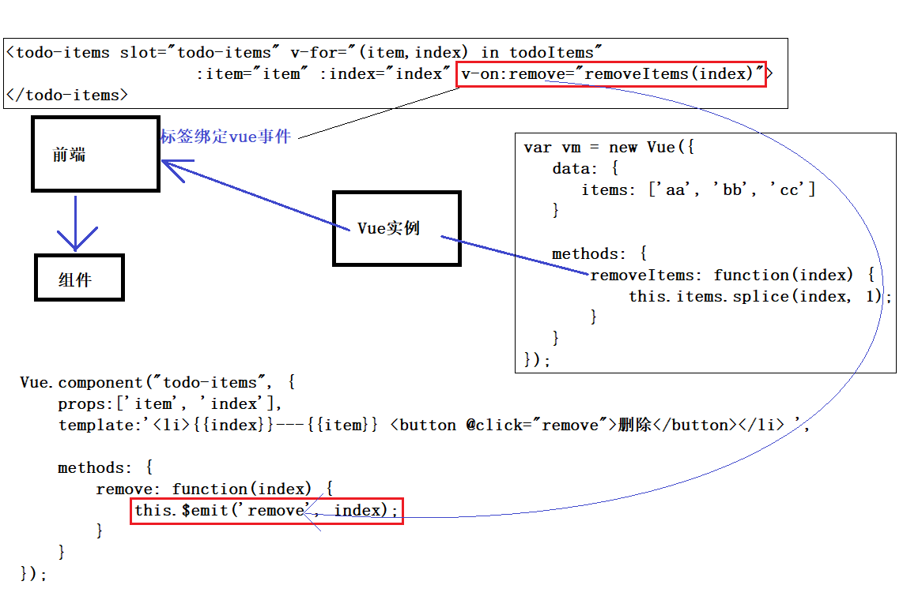
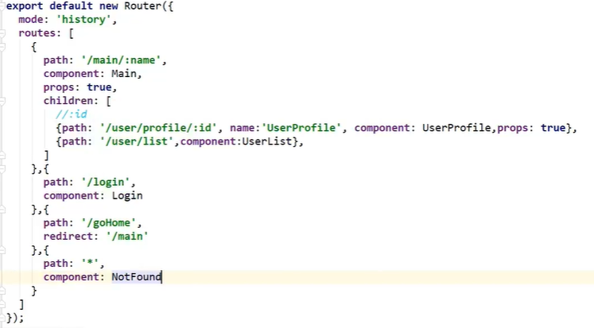

### Vue初阶

```
<!--View层-->
<div id="app">
	{{message}}
</div>
<script>
	//创建一个Var对象
	//el是标签元素，表示id为app的标签
	//data表示一个对象，对象都是键值对的集合
	var vm = new Var({
		el: "#app",
		//Model层 ： 数据
		data: {
			message: "hello, wolrd!"
		}
	})
</script>
```

因为是MVVC设计模式，这里只看见了View和Model层，没有看见数据交互，我们通过浏览器的Console控制台，修改message变量`vm.message="he he he he"`，可以看到界面的数据变化，这就是事件驱动，不需要刷新页面就可以改变界面。并没有改变DOM对象，这就是虚拟DOM

##### 双向绑定

MVVM框架，即数据双向绑定，当数据变视图也变，视图变数据也同步变化

简单的例子，当你在输入框输入内容，在视图其他位置同步更新你的内容

```
<div id="app">
//让message位置同步更新输入的数据，使用v-model指令，意思就是message变量动态获取标签中的值
输入的文本：<input type="text" v-model="message"> {{message}}
</div>
<script>
	var vm = new Var({
		el: "#app",
		data: {
			message: "123"
		}
	});
</script>
```

v-model会忽略所有表单元素的value、checked、select特性的初始值总是将Vue实例的数据作为数据来源

##### if

见demo4

##### for

见demo5

##### 事件on

见demo6

##### 网络通信

可以使用jQuery.ajax()，

但是现在使用Axios，Axios是一个开源用在浏览器端和NodeJS异步通信框架，作用是实现AJAX异步通信。

由于Vue.js是视图层框架，并且作者(尤雨溪)严格遵守SoC(关注度分离原则)，所以Vue.js不包含AJAX通信功能，为了解决通信问题，单独开发了一个vue-resource的插件，不过2.0版本后不维护这个插件了，并推荐了Axios框架。

```
下载方式：npm install axios
```

Vue的生命周期，从开始创建、初始化数据、编译模板、挂载DOM、渲染->更新->渲染、卸载等一系列过程，如果想要观察这个过程可以通过浏览器调试，将NetWork栏中的最后一个选项可以调节网速，将网速设置成slow 3G，网速过慢，每一个包过来的就慢，就要有一个数据渲染的过程呈现

```html
<body>
		<div id="vue">
			{{message}}
            {{info.name}}
            {{info.address.street}}
            <a v-bind:href="info.url">点我</a>
		</div>
		
		<script src="vue.js" type="text/javascript" charset="UTF-8"></script>
		<script src="https://unpkg.com/axios/dist/axios.min.js"></script>
		<script>
			var vm = new Vue({
				el: "#vue",
				data: {
					message: "123"
				},
				
				//钩子函数，程序执行的时候，插入中间去执行，加载AJAX建议在mounted去实现，
				//链式编程，先获取get请求，然后获取response，然后执行控制台打印response的内容
				//=>是ES6新特性，IDEA要切换js语言版本，很多浏览器不支持
				mounted() {
					//axios.get('data.json').then(response=>(console.log(response.data)));
					//response.data，表示接受到的包所有数据，而不是内容中的data字段，而response只是定义的一个单词
					axios.get('data.json').then(r=>(this.message=r.data));
				},
                //重要的是，方法之间也要逗号间隔
                
                //也是钩子，但是和data属性一样，是一下格式，将请求的json赋给这里的数据
				data() {
					//请求的返回参数格式，必须和json字符串一样
					return{
                        //返回的对象名叫info
						info: {
							name: null,
							address: {
								street: null,
								city: null,
								country: null
							},
                               url: null
                          }
					}
				}
			});
		</script>
	</body>
```

因为这样加载的过程，会显示原来模板，所有可以设置成如果没有加载出数据就白屏的操作

```html
<head>
	<style>
		//如果没有数据出来则白屏
		[v-clock]{
			display: none;
		}
	</style>
</head>
<body>
	<div id="vue" v-clock>
		{{message}}
	</div>
</body>

<script> new Vue………… </script>
```

##### 计算属性

计算出来的结果，保存在属性中，内存中运行。就是将结果缓存起来（将行为转换为静态属性）

```
		<div id="app">
			<p>currentTime1：{{currentTime1()}}</p>
			<p>currentTime2：{{currentTime2}}</p>
			<!--第一个为方法，需要加括号；第二个为计算属性，不加括号-->
		</div>
		
		<script src="vue.js" type="text/javascript" charset="UTF-8"></script>
		<script>
			var vm = new Vue({
				el: "#app",
				data: {
					message: "123"
				},
				
				methods: {
					currentTime1: function() {
						return Date.now();		//返回当前时间戳
					}
				},
				
				computed: {	//计算属性，methods和computed方法不能重名，重名之后methods方法优先级高
					currentTime2: function() {
						return Date.now();		//返回当前时间戳
					}
				}
			});	
		</script>
```

计算属性和方法有区别，每次调用方法都会重新计算，而属性不需重新计算，而是缓存。但是

```
				computed: {	//计算属性，methods和computed方法不能重名，重名之后methods方法优先级高
					currentTime2: function() {
						this.message;
						return Date.now();		//返回当前时间戳
					}
				}
```

向这个计算属性中有`this.message`，当message变化时，则会重新计算属性

> 结论：调用方法是每次需要计算，如果计算结果不经常变化，就可以将结果缓存起来，使用计算属性的主要特性就是为了将不经常变化的结果缓存，节约系统开销。


##### 自定义事件内容分发



#### 总结

- 基础语法
- 条件判断if/循环for
- 网络通信：axios
- 组件以及界面布局


###### 常用属性

- v-if
- v-else-if
- v-else
- v-for
- v-on 绑定事件，简写@
- v-model数据双向绑定
- v-bind给组件绑定参数，简写：


这只是vue入门，开发并不是这么写，Vue的开发都是要基于NodeJS，实际开发采用vue-cli脚手架开发，vue-router路由，vuex做状态管理；Vue UI界面我们一般使用ElementU（饿了么出品），或者ICE（阿里巴巴出品）来快速搭建前端项目

### Vue进阶

##### nodejs安装

官网下载：[http://nodejs.cn/download/](http://nodejs.cn/download/)（会自动配置环境变量，Path中多出安装nodejs的路径，一路next即可，选择安装路径）

其中nodejs自带npm，但是npm下载很慢，所以下载淘宝镜像加速器（cnpm）

```
npm install cnpm -g
#安装后的位置为C:\Users\lenovo\AppData\Roaming\npm\node_modules\cnpm

#第二种方法解决npm速度慢
npm install --registry=https://registry.npm.taobao.org	# 每次下载东西时加入这个参数
```

#### 使用vue-cli脚手架

安装vue-cli

```
cnpm install vue-cli -g

# 测试是否安装成功
# 查看可以基于哪些模板创建vue应用程序，通常选择webpack
vue list

运行如下：
C:\WINDOWS\system32>vue list
  Available official templates:
  ★  browserify - A full-featured Browserify + vueify setup with hot-reload, linting & unit testing.
  ★  browserify-simple - A simple Browserify + vueify setup for quick prototyping.
  ★  pwa - PWA template for vue-cli based on the webpack template
  ★  simple - The simplest possible Vue setup in a single HTML file
  ★  webpack - A full-featured Webpack + vue-loader setup with hot reload, linting, testing & css extraction.
  ★  webpack-simple - A simple Webpack + vue-loader setup for quick prototyping.
```

##### 创建vue程序

cmd[尽量管理员]进入一个目录下（要创建项目目录）

```
# myvue为项目名，webpack为应用模板理性
vue init webpack myvue
# 为了了解项目目录结构，一路会有很多选择no
```

##### 初始化并运行

```
cd myvue 		# 进入到项目中
npm install 	# 安装所有的依赖环境，在node_modules目录下，下载好多文件
# 如果npm中间有什么错误，均会有解决方法提示，按照指示运行即可
npm run dev		# 运行启动项目，默认开启本机8080端口，使用浏览器访问即可
# 此命令IDEA不能运行，因为需要管理员权限
```

前端代码写在src中

#### 使用Webpack

##### Webpack

Webpack是js应用程序的静态模块打包器，会递归的构建一个依赖关系图

Webpack是一款模块加载器兼打包工具，它把各种资源，如JS、JSX、ES6、SASS、LESS、图片等都作为模块来处理和使用

安装：

```
npm install webpack -g
npm install webpack-cli -g

# 测试安装成功
webpack -v
webpack-cli -v
```


创建webpack.config.js配置文件

- entry：入口文件，指定Webpack用哪个文件作为项目入口
- output：输出，指定Webpack把处理完成的文件放置到指定路径
- module：模块，用于处理各种类型的文件
- plugins：插件，如：热更新、代码重用等。
- resolve：设置路径指向
- watch：监听，用于设置文件改动后直接打包

##### 使用webpack

1. 创建一个空文件夹

2. 用IDEA打开，然后创建modules空文件夹

   ```
   # hello.js文件
   exports.sayHi = function() {
   	document.write("<h1>Hello</h1>");
   };
   
   # main.js文件
   var hello = require("./hello");
   hello.sayHi();
   ```

3. 项目下新建webpack.config.js文件

   ```
   modules.exports = {
   	entry: './modules/main.js',
   	output: {
   		filename: "./js/bundle.js"
   	}
   };
   ```

   4. 项目下使用webpack命令，将我们的代码打包输出在output路径下

   5. 项目下创建index.html文件，使用下面即可调用js文件

      ```
   <!--前端的模块化开发-->
      <script src="dist/js/bundle.js"></script>
      ```
   

#### vue-router路由

重定向和请求转发不再交给后端，而是vue前端来做

```
# 在项目下安装
npm install vue-router --save-dev
```

##### 简单的路由项目

1、下面在components目录下建立两个组件，组件就是一个小页面

/src/components/Content.vue文件

/src/components/Main.vue文件

2、在router目录下建立跳路由配置文件

/src/router/index.js

```
import Vue from 'vue'
import VueRouter from 'vue-router'
import Content from '../components/Content'
import Main from '../components/Main'

Vue.use(VueRouter);

export default new VueRouter({
	//两种模式，hash：路径带#号，如http://localhost:8080/#/login；history：不带#号
	mode: 'history',
	routes: [
		{
			//路由路径，url的路由路径
			path: '/content'
			name: 'content'
			//跳转的组件
			component: Content
		},
		{
			path: '/main'
			name: 'main'
			component: Main
			//嵌套路由
			children: [
				{
					path: '',
					component:
				}
			]
		}
	]
});
```

/src/App.vue文件，为main.js加载的页面，里边的`<router-link to="">`相当于`<a href="">`

```
<template>
	<div id="app">
		<!--这就是相当于a标签-->
		<router-link to="/main">首页</router-link>
		<router-link to="/content">内容页</router-link>
		<!--router-view的意思是在这个标签的位置进行展示to之后的跳转-->
		<router-view></router-view> <!--展示视图-->
	</div>
</template>
<script>
export default {
	name: 'App'
}
</script>
<style>
#app {
  font-family: 'Avenir', Helvetica, Arial, sans-serif;
  -webkit-font-smoothing: antialiased;
  -moz-osx-font-smoothing: grayscale;
  text-align: center;
  color: #2c3e50;
  margin-top: 60px;
}
</style>
```

main.js文件

```
import Vue from 'vue'
import App from './App'
import router from './router'	//因为router下只有一个index.js，index会默认加载

//显示声明使用VueRouter
Vue.use(VueRouter);

new Vue ({
	el: '#app',
	//配置路由
	router,
	components: {App},
	templates: '<App/>'
});
```

#### ElementUI组件库

可能比bootstrap更好看，一些漂亮的组件

指南：[https://element.eleme.cn/#/zh-CN/component/installation](https://element.eleme.cn/#/zh-CN/component/installation)

npm安装

```
npm i element-ui -S
```

使用CDN

```
<!--引入样式-->
<link rel="stylesheet" href="https://unpkg.com/element-ui/lib/theme-chalk/index.css">
<!--引入组件库-->
<script src="https://unpkg.com/element-ui/lib/index.js"></script>
```

##### 创建工程

```
# 建一个名为hello-vue的项目
vue init webpack hello-vue

# 进入工程目录
cd he1lo-vue
# 安装vue-router
npm install vue-router --save-dev
# 安装element-ui
npm i element-ui -S
# 安装依赖
npm install
# 安装SAsS 加载器
cnpm install sass-loader node-sass --save-dev
# 启动测试
npm run dev
```

首页什么内容都没有，主要写好两个Vue组件，在src/views目录下建立两个分别为Login.vue、Main.vue，组件Login为在ElementUI官方拷贝代码，进行登录验证，如果登录成功则，进入Main页面

```
//Login.vue文件
<script>
exports defalut {
	name: "Login",
	……
	methods: {
		onSubmit(formName) {
			this.$refs[formName].validate((valid) => {
				if (valid) {
					//使用vue-router路由到指定页面，该方式称为编程式导航
					this.$router.push("/main");
				} else {
					this.dialogVisble = true;
					return false;
				}
			});
		}
	}
}
</script>
```

##### router路由参数的传递

```
<!--name地址，param传递参数-->
<router-link v-bind:to="{name:'UserProfile', params:{id:1}}">

router下index.js配置文件
routes: [
		{
			//路由路径，url的路由路径
			path: '/user/profile/:id'
			name: 'UserProfile'
			//跳转的组件
			component: UserProfile
		}
	]
	
UserProfile.vue文件
<template>必须用div包起来所有内容
<div>
{{$route.params.id}}
<div>
</template>
```

##### 404

前端现在找不到还不能显示404

可以在views目录下新建一个Not Fount.vue，然后在router下index配置文件中，最后填写一个路由path为*。



static目录下所有文件可通过url直接访问